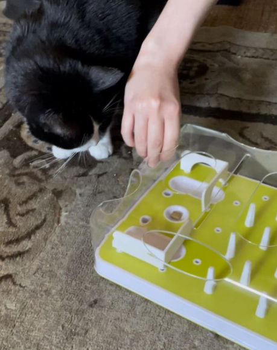

# Gabriel's Portfolio
Hi, my name is Gabriel. I am an Applied Statistics M.S. student at California State University, Long Beach (CSULB). I'm passionate about using statistics and machine learning to extract valuable insights from data. I graduated from UCLA with a B.S. in Applied Mathematics with a minor in Chinese.

## Projects

### 1. Effects of Treat Flavors on Feline Puzzle-Solving Speed

**Description:** 
This study investigates how different treat flavors affect the cognitive performance of a senior domestic male tuxedo cat engaging in feeding puzzles. The time required for the cat to consume treats of seafood, chicken, dairy, and tuna flavors while completing puzzles was measured. Using a 4 x 4 replicated Latin Square design, we analyzed the time taken to discern if flavor preferences influenced the cat's puzzle-solving efficiency. Pre-planned contrasts were also explored to address specific questions regarding treatment means. The findings indicate no significant impact of treat flavor on the time to solve puzzles. However, the level of puzzle difficulty was a notable factor affecting performance. These results offer valuable considerations for future studies on feline behavior and puzzle interaction.

- **Technologies Used:** SAS, R
- **Key Techniques:** Latin Square Design
- **Date:** Fall 2023
- **Collaborator:** Richard DiazDeLeon
- ([View Report](https://github.com/gfanuch/Gabriel_Portfolio/blob/main/Final%20Project%20-%20Gabriel_Fanucchi_Richard_Diazdeleon.pdf))

Thank you for visiting my portfolio! Feel free to reach out if you have any questions or would like to collaborate on a project!
